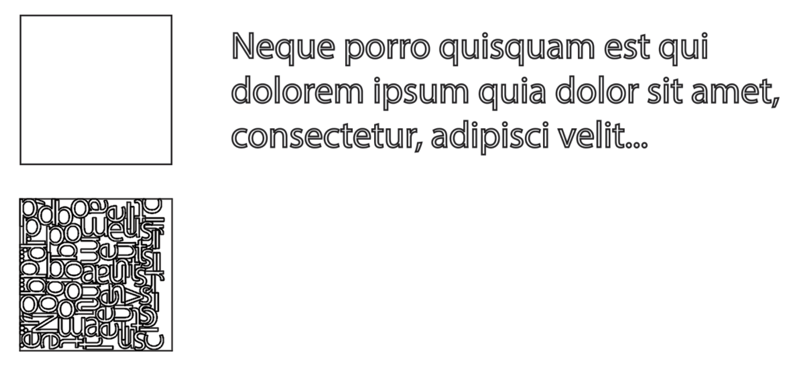
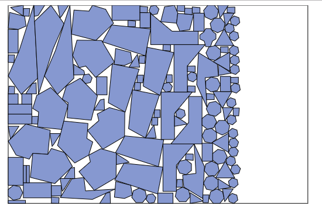

# Nest4J

Nest4J is a Nest algorithm tool written in Java which designed to run in server-side.  And it is based by [SVGNest](https://github.com/Jack000/SVGnest).

Also, Nest4J is my Undergraduate Graduation Project which let me know the charm of Computational geometry.

# What is Nest Problem?

Given a square piece of material and some letters to be laser-cut:

We want to pack all the letters into the square, using as little material as possible. If a single square is not enough, we also want to minimize the number of squares used.

In the CNC world this is called "nesting", and software that does this is typically targeted at industrial customers and very expensive.



for more detail , please go to [SVGNest](https://github.com/Jack000/SVGnest)

## Performance
I used SVGNest Demo to test Nest4J and here is my result.



## How to use?


Nest4J is based by SVGNest and ported it into Java so that it can runs in server-side.

It is esay to use Nest4J by following steps.

## Env

Nest4J needs JDK1.8 version , and the maven dependency of [Clipper-java](https://github.com/lightbringer/clipper-java). You have to download [Clipper-java](https://github.com/lightbringer/clipper-java) and install it into your local maven repository.

## Express an Polygon

Nest4J use a common way to express an polygon by a collection of Points. Here is an example to show you .


**It is important that Nest4J express polygons in an 2d coordinate system , so you have to ensure that each polygon won't be covered by another.**

```java
        NestPath bin = new NestPath();
        double binWidth = 511.822;
        double binHeight = 339.235;
        bin.add(0, 0);
        bin.add(binWidth, 0);
        bin.add(binWidth, binHeight);
        bin.add(0, binHeight);

```


## Construct an material list.

It is easy to construct a material list when we know how to express a ploygon. it's just a collection of polygons.

```java
        List<NestPath> list = new ArrayList<NestPath>();
        list.add(polygon1);
        list.add(polygon2);
        list.add(polygon3);

```

### Extended Attributes of Polygon

When one polygon is constructed , its default Rotation attr is 0 , which means we will fix it during our Nest Program.


